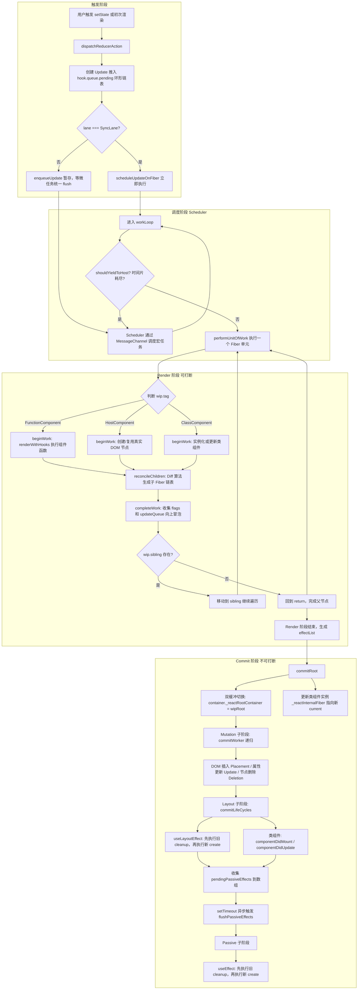

# Mini React —— 从 0 实现的 React 核心引擎

> 一个大二学生为了搞懂 React 源码到底在干什么，而写的"能跑"的 React。

## 为什么做这个项目

学 React 一年后，我发现自己虽然能熟练写 Hooks，但对背后的机制一知半解：
- `setState` 之后到底发生了什么？
- Fiber 树为什么能"打断"渲染？
- Diff 算法为什么是 O(n) 而不是 O(n³)？
- `useEffect` 和 `useLayoutEffect` 的执行时机差在哪？

所以我决定删掉 `node_modules/react`，自己写一个能跑起来的版本。过程中对照 React 18 源码，把大概 1800 行核心逻辑拆成了 Scheduler、Reconciler、Renderer 三层。写完之后回头看官方源码，终于能看懂了。

## 实现了什么

这不是一个玩具级的 demo，它包含 React 的核心链路：

### 1. Fiber 架构
- 完整的 Fiber 链表结构（child / sibling / return）
- 双缓冲机制（current ↔ workInProgress），支持更新时复用旧节点
- **WIP 树隔离**：渲染期间所有修改发生在 WIP 树上，current tree 保持只读

### 2. 调度器 Scheduler
- 基于 `MessageChannel` 的宏任务调度（和 React 18 一致）
- 时间片机制（5ms），支持 `shouldYieldToHost()` 让出主线程
- 任务优先级队列（基于小顶堆）

### 3. Reconciler 协调器
- **Diff 算法**：单端遍历 + Map 复用，完整实现 React 的两轮 Diff 策略
- **批量更新**：支持自动批处理（batchUpdates）和 `flushSync` 强制刷新
- **Eager Bailout**：状态未变时直接跳过调度

### 4. Hooks（全链路实现）
- `useState` / `useReducer`
- `useEffect` / `useLayoutEffect`（含清理函数和异步调度）
- `useMemo` / `useCallback`
- 支持 Hooks 规则校验（开发时误用会抛错）

### 5. 组件支持
- 函数组件
- 类组件（含 `setState` 更新链路）
- Fragment
- Host Component（原生 DOM 标签）

### 6. Lane 模型简化版
- 定义 `SyncLane`（同步，不可打断）和 `DefaultLane`（默认，可调度）
- `flushSync` 期间自动升级为 SyncLane，直接同步执行 workloop
- workloop 中预留 `shouldInterrupt` 钩子，支持高优先级打断低优先级渲染的代码路径

## 项目结构

```
src/lib
├── react/                    # React 核心 API
│   ├── React.js              # Component 基类
│   └── ReactHooks.js         # 全部 Hooks 实现
├── react-dom/                # DOM 渲染器
│   └── ReactDom.js
├── reconciler/               # 协调器（核心中的核心）
│   ├── ReactFiber.js         # Fiber 节点创建 + createWorkInProgress
│   ├── ReactFiberWorkLoop.js # 工作循环 + 调度入口 + Lane 分发
│   ├── ReactFiberBeginWork.js
│   ├── ReactFiberCompleteWork.js
│   ├── ReactFiberCommitWork.js
│   ├── ReactFiberReconciler.js
│   ├── ReactChildFiber.js    # Diff 算法主逻辑
│   └── ReactChildFiberAssistant.js
├── scheduler/                # 调度器
│   ├── Scheduler.js          # MessageChannel + 时间片
│   └── SchedulerMinHeap.js   # 任务优先级队列
└── shared/                   # 工具函数 + 标志位 + Lane 常量
    ├── batch.js              # 批量更新
    └── utils.js
```

## 架构流程图



## 本地运行

```bash
pnpm install
pnpm dev
```

`App.jsx` 里可以直接用你自己实现的 React API（项目里我配了 alias，`react` 和 `react-dom` 会指向 `src/lib`）。

## 核心测试

```bash
pnpm test
```

覆盖范围：
- **Diff 算法**：复用、删除、移动、初次渲染 Placement
- **Hooks**：useState/useReducer mount & update、函数式更新、hook 错位检测、effect tag 标记与 cleanup 清理
- **批处理**：同一事件循环合并、flushSync 同步执行

## 我踩过的一些坑

### 坑 1：`linkFiber` 按值传递导致 sibling 链表断裂
一开始写 Diff 后的 fiber 链接逻辑时，我在 `linkFiber` 函数内部直接写了 `lastNewFiber = newFiber`，以为这样调用方的变量会被更新。结果页面永远只能渲染出第一个子节点——JS 的对象引用是按值传递的，函数内部的重新赋值对外部变量毫无影响。后来改为 `return newFiber`，让调用方重新接收返回值，sibling 链表才正常建立。这个 bug 让我对"JS 里没有指针"这件事有了肌肉记忆。

### 坑 2：`scheduleUpdateOnFiber` 一路回溯到了容器对象
最初实现 `scheduleUpdateOnFiber` 时，`while (node.return)` 会一直往上遍历到根节点之外，把 `_isContainer` 容器对象也当成了 fiber，导致后续 `beginWork` 时拿到一个根本不是 fiber 的东西，直接报错。修复方式是在循环条件里加了 `node.return.tag !== undefined`，确保停在真正的 fiber 上。这件事让我意识到 React 的"根"其实有两层：容器（container）和根 fiber（root fiber）。

### 坑 3：useEffect 和 useLayoutEffect 的执行时机
最早我把 useEffect 的回调塞进了 `commitWorker` 的同步递归里，结果 useEffect 在 DOM 更新前就执行了，而且每次 commit 节点都会触发一次，性能稀烂。后来改成在 `commitWorker` 阶段只收集 Passive Effect，等整棵树 commit 完成后统一用 `setTimeout` 异步 flush，这才对齐了 React 的行为：useLayoutEffect 同步（浏览器绘制前），useEffect 异步（绘制后）。

### 坑 4：effect cleanup 不是简单的 "destroy = create()"
一开始我以为 effect 的 cleanup 就是 `effect.destroy = create()` 这么简单，结果踩了大坑。第一个问题是：update 时如果 deps 没变，我直接 `return` 不 push effect，导致 updateQueue 为空，commit 阶段根本遍历不到这个 hook，旧 cleanup 被静默跳过。第二个问题更隐蔽：即使 deps 变了，新 push 的 effect 的 `destroy` 初始值是 `undefined`，而旧的 destroy 跟着旧 effect 对象一起被 GC 了，永远没机会执行。

还有组件卸载：`commitDeletion` 里我只处理了类组件的 `componentWillUnmount`，函数组件的 hooks cleanup 完全没管。

后来翻 React 源码（`ReactFiberHooks.js` 和 `ReactFiberCommitEffects.js`），发现真正的设计是：
- **EffectInstance**：用一个独立对象 `{ destroy: undefined }` 存 cleanup，跨 render 复用同一个引用
- **HasEffect 标志位**：mount 和 deps 变化时打 `Passive | HasEffect`，deps 未变时只打 `Passive`，commit 阶段通过位运算 `(tag & flags) === flags` 判断是否执行
- **无论 deps 变不变都 push effect**：保证 updateQueue 的环形链表结构始终完整
- **严格的时序**：commit 阶段必须先 `commitHookEffectListUnmount` 再 `commitHookEffectListMount`，unmount 时读 `inst.destroy`，mount 时写 `inst.destroy = create()`
- **卸载时递归 cleanup**：`commitDeletion` 遍历被删除的子树，对每个函数组件的 updateQueue 执行所有 destroy

改完之后终于能正确回答"为什么 useEffect 的 cleanup 在 re-render 前执行、在 unmount 时也会执行"这个问题了。

### 坑 5：渲染阶段触发 setState 导致死循环
如果没有防护，在 `renderWithHooks` 里调用 `setState` 会立刻修改 `wip`，而 `wip` 正在被遍历，结果就是无限重新调度。我加了 `isRendering` 锁和 `renderPhaseUpdates` 队列：渲染阶段产生的更新先暂存，等当前轮次的 `commitRoot` 结束后再统一触发。这也解释了为什么 React 源码里有一堆 `didScheduleRenderPhaseUpdate` 的判断。

### 坑 6：批量更新不是天然的，要自己实现
一开始以为"在一个事件里多次 setState 只会触发一次重渲染"是框架自动做的，结果发现如果不加干预，每次 `dispatchReducerAction` 都会独立调用 `scheduleUpdateOnFiber`，一次点击能触发十几次 render。后来自己实现了 `isBatchingUpdates` 标志位 + `enqueueUpdate` / `flushUpdates`，在合成事件入口和 `scheduleCallback` 里配合，才实现了批量更新。

### 坑 7：Eager State Bailout —— 状态没变就不该 render
有一次写 Counter，点击按钮设置同样的数字，发现组件还是会重新走一遍完整渲染链路。排查后发现 `dispatchReducerAction` 没有把"新状态和旧状态相同"的情况过滤掉。后来引入了 `eagerState` 缓存：在 dispatch 阶段就预跑一遍 reducer，如果 `Object.is` 判定相同，直接 return，不走任何调度。这个优化在 React 源码里叫 Eager State Reducer。

### 坑 8：直接修改 current fiber 的 sibling
最初为了限制 work loop 的遍历范围，我在 `dispatchReducerAction` 里直接写了 `fiber.sibling = null`。后来意识到这破坏了 current tree 的只读原则——React 的哲学是 current 不可变，所有修改应该在 WIP 树上进行。

**重构过程**：
1. 在 `ReactFiber.js` 中新增了 `createWorkInProgress`，实现了双缓冲机制中"基于 current 创建 WIP"的标准流程
2. 在 `scheduleUpdateOnFiber` 中，不再直接把 current 节点赋值给 `wip`，而是调用 `createWorkInProgress(node)` 创建一个新的 WIP 根节点
3. 把 `wip.sibling = null` 的切断逻辑从 `dispatchReducerAction` 迁移到 `scheduleUpdateOnFiber` 中，现在动的是 WIP 树，不是 current 树
4. 即使渲染被中断或出错，current tree 的结构依然保持完整

> 关键设计反思：我最初在 dispatch 阶段为了简化，直接写了 `fiber.sibling = null` 来限制 work loop 的遍历范围。但后来 review 代码时发现这违反了 React 的只读原则——current tree 不应该在渲染期间被修改。所以我重构了 `scheduleUpdateOnFiber`，在设置 `wip` 时通过 `createWorkInProgress` 创建一个新的 WIP 根节点，把 sibling 的切断放在 WIP 树上。这样即使渲染被中断或出错，current tree 的结构依然是完整的。

### 坑 9：双缓冲不是"有了 alternate 就够了"——current/WIP 切换的三个隐藏 bug

这是我在本项目里踩得最深的一个坑，也是让我真正理解 React 双缓冲精髓的一次。

**第一层误解：我以为 `createWorkInProgress` 只克隆根节点就够了**

一开始我疑惑：为什么 `scheduleUpdateOnFiber` 里只调用 `createWorkInProgress(node)` 转换根节点？子节点不也在此时转换吗？commit 时岂不是只基于这一个节点？后来仔细看 work loop 才明白——子 fiber 是在 `performUnitOfWork → beginWork → reconcileChildren` 的过程中**逐步创建**的，根节点只是入口。这个设计是对的，React 源码同样如此。

**第二层误解：我以为必须像 React 源码一样做 `root.current = finishedWork`**

当我进一步分析时，发现 `instance._reactInternalFiber` 永远指向第 1 轮渲染的 WIP 根，而 `createWorkInProgress` 每次都复用它的 `alternate`（原始根）。我推断：从第 3 轮开始，diff 看到的旧树永远是第 1 轮的，而且类组件 `setState` 的 `updateQueue` 会丢失。于是我想在 `commitRoot` 里加上 `container._reactRootContainer = wipRoot` 来手动切换 current。

但写完这个计划后发现测试挂了。回滚后重新分析原始代码，我才意识到：
- `instance._reactInternalFiber` 始终指向同一棵 WIP 树，`createWorkInProgress` 会复用它的 `alternate`
- `alternate` 之间互相链接，确实形成了一个能跑的简化版双缓冲
- 第 2 轮更新时，diff 看到的 `oldFiber = returnFiber.alternate?.child` 其实能追溯到上轮子树

所以**回滚后代码其实是能跑的**，但我之前的 plan 是多此一举，甚至破坏了原有的平衡。

**第三层真相：简化版双缓冲确实有三个隐藏 bug**

虽然大框架能跑，但当我写端到端测试去验证类组件 `setState` 时，发现 DOM 根本不更新。debug 后定位到三个问题：

**Bug 1：`createWorkInProgress` 没有同步 `stateNode`**

我的 `createWorkInProgress` 在复用 `alternate` 时，只重置了 `flags/child/sibling`，却漏了 `stateNode`。导致第 2 轮的 WIP 根 `stateNode = null`，`updateClassComponent` 误判为 mount 分支，直接 `new` 了一个新实例，跳过了 `processUpdateQueue`。

查 React 源码 `ReactFiber.js:343` 才知道：`createWorkInProgress` 里明确有一行 `workInProgress.stateNode = current.stateNode`。我漏了这行。

**Bug 2：`createWorkInProgress` 把 `updateQueue` 直接清空为 `null`**

我原本写了 `wip.updateQueue = null`，意图是"重置副作用字段"。但类组件的 `setState` 正是把待处理的更新推到了 fiber 的 `updateQueue` 上。`processUpdateQueue` 读取时发现是 `null`，自然什么更新都不处理。

React 源码的做法更精细：它不清空 `updateQueue`，而是在 `processUpdateQueue` 消费完之后才置空。我的简化版直接做了一次性转移：`wip.updateQueue = current.updateQueue; current.updateQueue = null`，确保 updateQueue 跟着 current → WIP 一起流转。

**Bug 3：`instance._reactInternalFiber` 永远指向第 1 轮 WIP**

`updateClassComponent` 只在 mount 时设置 `instance._reactInternalFiber = wip`，后续 update 分支 never 更新它。这导致 `setState` 永远把 `updateQueue` 写到同一棵旧树上。虽然靠 `alternate` 链勉强能工作，但严格来说 current 的身份已经漂移了。

修复方式是在 `commitRoot` 后遍历 WIP 树，把所有类组件实例的 `_reactInternalFiber` 更新为新的 current 节点。同时把 `container._reactRootContainer` 指向新的 current 根，让 `scheduleUpdateOnFiber` 始终能拿到正确的起点。

**最终的正确时序**：

```
第1轮 mount:
  container._reactRootContainer = A (原始根)
  WIP = B (createWorkInProgress(A), B.stateNode = A.stateNode)
  commit 后: container._reactRootContainer = B, instance._reactInternalFiber = B

第2轮 update:
  setState 写到 B.updateQueue
  scheduleUpdateOnFiber 取 currentRoot = B
  createWorkInProgress(B) 复用 A，同步 A.stateNode = B.stateNode
  A.updateQueue = B.updateQueue (转移), B.updateQueue = null
  processUpdateQueue(A, 实例) 正确执行
  commit 后: container._reactRootContainer = A, instance._reactInternalFiber = A
```

现在 current 和 WIP 严格交替，diff 依据始终是最新的旧树，类组件 `setState` 也能正确更新 state 和 DOM。

> 这次踩坑让我明白：React 的双缓冲不是"两个对象互相 alternate"这么简单，它背后有一整套状态流转的约定——`stateNode` 要同步、`updateQueue` 要流转、current 的身份要切换。只看源码的某一行很容易漏掉这些隐含契约。

## 和 React 源码的差异

这个项目是**为了理解原理**而做的，不是 1:1 还原：

| 特性 | 本项目 | React 18 源码 |
|------|--------|---------------|
| 调度器 | MessageChannel + 时间片 | 同上，但源码还有优先级通道 |
| Diff | 两轮遍历 + Map | 基本一致 |
| 并发模型 | **Lane 模型简化版（SyncLane + DefaultLane + 可打断骨架）** | 完整 Lane 模型 + 31 条优先级位运算 |
| Hooks | 基础 Hooks | 完整 Hooks + 内部优化 |
| WIP 树 / 双缓冲 | 已引入 `createWorkInProgress`；commit 后手动切换 `container._reactRootContainer` 并同步 `stateNode` 与 `updateQueue` | 完整双缓冲 + FiberRoot.current 指针 + 复用池；`createWorkInProgress` 同步 `stateNode` 但不转移 `updateQueue`（由 `processUpdateQueue` 消费后清理） |
| Suspense | ❌ 未实现 | ✅ |
| Error Boundary | ❌ 未实现 | ✅ |

## 后续计划

**高优先级：**

- [ ] **完整 Lane 模型 + 调度器多优先级**
  - 目前只有 `SyncLane` / `DefaultLane` 两条，源码中是 31 位 lane 位运算 + 5 级调度优先级（`ImmediatePriority` / `UserBlockingPriority` / `NormalPriority` / `LowPriority` / `IdlePriority`）
  - 参考源码：`ReactFiberLane.js`、`SchedulerPriorities.js`

- [ ] **Suspense 边界机制**
  - 支持子树 `throw Promise` → 捕获到 Suspense boundary → 切换 fallback UI → Promise resolve 后恢复真实内容
  - 参考源码：`ReactFiberSuspenseComponent.js`、`ReactFiberThenable.js`

- [ ] **Error Boundary（错误边界）**
  - 类组件支持 `static getDerivedStateFromError` + `componentDidCatch`
  - 渲染阶段抛错时，React 会沿 Fiber 树向上找到最近的 Error Boundary 并进入 fallback 渲染路径
  - 参考源码：`ReactFiberThrow.js` 中的 `throwException` 与 `createRootErrorUpdate`

- [ ] **useTransition / useDeferredValue**
  - React 18 并发特性的标志性 API：`startTransition` 包裹的更新标记为 `TransitionLane`，允许被更高优先级更新打断
  - `useDeferredValue` 依赖 Transition 机制实现"延迟值"，能让 UI 保持响应
  - 参考源码：`ReactFiberTransition.js`、`ReactStartTransition.js`

**中等优先级（性能优化 + 开发体验）：**

- [ ] **React.memo + forwardRef**
  - `memo` 通过自定义比较函数决定是否需要重新渲染；`forwardRef` 解决函数组件 ref 透传问题
  - 参考源码：`ReactMemo.js`、`ReactForwardRef.js`

- [ ] **合成事件系统（SyntheticEvent）**
  - 在根节点统一代理所有事件，实现事件委托、优先级调度、跨浏览器兼容
  - 参考源码：`react-dom/src/events/` 目录

- [ ] **useContext / createContext**
  - 跨层级传递数据，需要配合 Fiber 树在 `beginWork` 时读取/传递 context value
  - 参考源码：`ReactContext.js`、`ReactFiberNewContext.js`

## 关于我

大二前端，喜欢折腾底层原理。这个项目是我深入理解 React 源码的笔记，如果你也在手写 React，欢迎交流。
